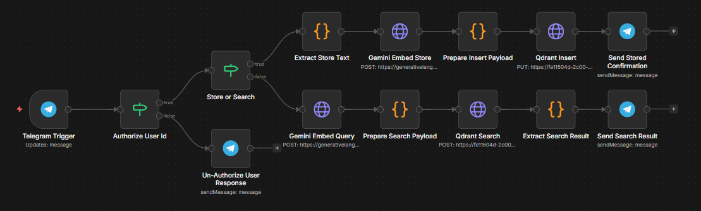

# 🧠 Telegram Semantic Memory Bot

> **Store anything. Find it by meaning - not keywords.**  
> A self-hosted Telegram bot powered by Gemini embeddings + Qdrant vector search, orchestrated with n8n.

[](https://n8n.io) [](https://qdrant.tech) [](https://aistudio.google.com) [](https://core.telegram.org/bots) [](LICENSE)

---

## 📌 What Is This?

A minimal but powerful **semantic memory bot** that lives inside Telegram.  
You `/store` text into a vector database and query it back in natural language - no exact keyword needed.

No LLM generates the response. It's pure **vector similarity search** - fast, private, and fully self-hosted.

---

## 🧩 Workflow Architecture



```
Telegram Message
      │
 ┌────▼─────┐
 │ Auth Gate │ ──✗──► Unauthorized Response
 └────┬─────┘
      │ ✓
 ┌────▼──────────┐
 │ Store or Search│
 └──┬────────┬───┘
    │        │
  /store   query
    │        │
  Gemini   Gemini
  Embed    Embed
    │        │
  Qdrant   Qdrant
  Insert   Search
    │        │
 Confirm  Send Result
```

---

## 👥 Who Is This For?

| User | How They Use It |
|---|---|
| 🧑‍💻 **Developers** | Store code snippets, architecture decisions, debug notes |
| 📚 **Researchers / Students** | Dump paper summaries, retrieve by concept |
| 💼 **Freelancers** | Log client notes, search by context not folder |
| 🧠 **Knowledge Workers** | Build a personal second brain over Telegram |
| ⚡ **Power Users** | Anyone who lives in Telegram and hates losing saved info |

---

## ✨ Key Features

- 🤖 **No LLM required** - pure vector similarity search, zero generative AI costs
- 🔐 **Auth gate** - only your Telegram ID can access it
- 📥 **Semantic storage** - text embedded to 3072-dim vectors via Gemini
- 🔍 **Meaning-based search** - finds closest match even with different wording
- 💬 **Simple Telegram commands** - no UI, no app, just chat
- 🏠 **Self-hosted** - your data stays in your Qdrant cluster
- ⚡ **One-click import** - ready-to-use `.json` workflow for n8n

---

## 🛠️ Tech Stack

| Layer | Tool |
|---|---|
| Interface | Telegram Bot API |
| Orchestration | n8n (self-hosted) |
| Embeddings | Google Gemini `gemini-embedding-001` |
| Vector DB | Qdrant Cloud |
| Language | JavaScript (n8n Code nodes) |

---

## 🚀 Quick Setup (Step by Step)

### Prerequisites
- [n8n](https://docs.n8n.io/getting-started/) instance (self-hosted or cloud)
- [Qdrant Cloud](https://cloud.qdrant.io) account (free tier works)
- [Google Gemini API key](https://aistudio.google.com/app/apikey) (free tier works)
- A Telegram Bot token from [@BotFather](https://t.me/botfather)

---

### Step 1 - Create Your Telegram Bot
1. Open Telegram → search `@BotFather`
2. Send `/newbot` and follow the prompts
3. Copy the token: `123456789:AABBCCDDaabbccdd...`

---

### Step 2 - Set Up Qdrant Collection
1. Go to [cloud.qdrant.io](https://cloud.qdrant.io) → create a free cluster
2. Copy your **cluster URL** and **API key**
3. Create a collection named `documents`:

```bash
curl -X PUT "https://YOUR_CLUSTER:6333/collections/documents" \
  -H "api-key: YOUR_API_KEY" \
  -H "Content-Type: application/json" \
  -d '{
    "vectors": {
      "size": 3072,
      "distance": "Cosine"
    }
  }'
```

---

### Step 3 - Import Workflow into n8n
1. Open your n8n instance
2. Click **Import from file**
3. Upload `telegram_semantic_bot.json` from this repo
4. The full workflow loads instantly - all nodes pre-configured

---

### Step 4 - Configure Credentials
In n8n, update the following:

| Node | What to Set |
|---|---|
| `Telegram Trigger` + Telegram send nodes | Add your Bot Token as Telegram credential |
| `Gemini Embed Store` + `Gemini Embed Query` | Replace `YOUR_KEY` in URL with Gemini API key |
| `Qdrant Insert` + `Qdrant Search` | Replace cluster URL and `api-key` header |
| `Authorize User Id` | Replace `YOUR_TELEGRAM_USER_ID` with your Telegram user ID |

> **Find your Telegram user ID:** Message [@userinfobot](https://t.me/userinfobot) on Telegram.

---

### Step 5 - Activate & Test
1. Toggle the workflow to **Active** in n8n
2. Open your bot on Telegram
3. Try these commands:

```
/store The Eiffel Tower is in Paris, built in 1889
/store Qdrant is an open-source vector database written in Rust
Where is the Eiffel Tower?
```

**Expected response:**
```
Best match (79.8% similarity):
The Eiffel Tower is in Paris, built in 1889
```

---

## 💬 Commands

| Command | Action |
|---|---|
| `/store <text>` | Embeds and saves text to Qdrant |
| Any other message | Semantic search - returns best matching entry |

---

## ⚠️ Known Limitations

- Returns raw stored text - no LLM-generated summarization
- Single authorized user by default (hardcoded user ID)
- No duplicate detection - same text stored twice = two points
- `Date.now()` IDs (fine for personal use, not for high concurrency)
- `score_threshold: 0.5` - lower to `0.3` if queries return empty on vague input

---

## 🗺️ Roadmap

| Version | Planned Features |
|---|---|
| **v1 (current)** | Text store + semantic search via Telegram |
| **v2** | Multi-format ingestion - PDF, DOCX, TXT, `.md` with chunking + BM25 hybrid search |
| **v3** | Multi-user support + web dashboard |

---

## 📄 License

MIT - use it, fork it, build on it.

---

<p align="center">Built with n8n · Qdrant · Gemini · Telegram</p>
